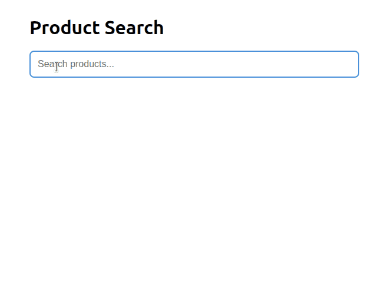

# go-xsearch

<p align="center">
  
</p>

<p align="center">
  <strong>Fuzzy search library for Go. Per-field scoring. Zero dependencies beyond CBOR.</strong>
</p>

<p align="center">
  <a href="https://github.com/mbow/go-xsearch/actions/workflows/ci.yml">
    
  </a>
  <a href="https://go.dev">
    
  </a>
  <a href="LICENSE">
    
  </a>
  <a href="https://goreportcard.com/report/github.com/mbow/go-xsearch">
    
  </a>
</p>

Index any Go type. Search with BM25 and Jaccard trigram scoring. Handle typos,
prefix matching, and category fallback — all in-process, with a warm-cache HTTP
response in **2.4 microseconds**.

<p align="center">
  
</p>

## The Library

The `xsearch` package is a domain-agnostic search engine. Implement one
interface and it indexes your data:

```go
type Drink struct {
    ID          string
    Name        string
    Category    string
    Ingredients []string
    Tags        map[string][]string
}

func (d Drink) SearchID() string { return d.ID }

func (d Drink) SearchFields() []xsearch.Field {
    fields := []xsearch.Field{
        {Name: "name", Values: []string{d.Name}, Weight: 1.0},
        {Name: "category", Values: []string{d.Category}, Weight: 0.5},
    }
    if len(d.Ingredients) > 0 {
        fields = append(fields, xsearch.Field{
            Name: "ingredients", Values: d.Ingredients, Weight: 0.4,
        })
    }
    for key, vals := range d.Tags {
        fields = append(fields, xsearch.Field{
            Name: key, Values: vals, Weight: 0.3,
        })
    }
    return fields
}
```

Build the engine and search:

```go
engine, err := xsearch.New(drinks,
    xsearch.WithBloom(100),
    xsearch.WithBM25(1.2, 0.75),
    xsearch.WithFallbackField("category"),
    xsearch.WithLimit(20),
)

results := engine.Search("smoky scotch")
for _, r := range results {
    item, _ := engine.Get(r.ID)
    fmt.Printf("%s (score: %.3f)\n", item.Fields[0].Values[0], r.Score)
}
```

### Configuration

| Option | Default | Purpose |
| ------ | ------: | ------- |
| `WithBloom(bitsPerItem)` | disabled | Bloom filter pre-rejection; higher = fewer false positives |
| `WithBM25(k1, b)` | 1.2, 0.75 | BM25 term saturation and length normalization |
| `WithAlpha(alpha)` | 0.6 | Blend weight: 0 = relevance only, 1 = scorer only |
| `WithLimit(n)` | 10 | Max results per search, must be in [2, 100] |
| `WithFallbackField(name)` | none | Field used for group fallback when direct matches are sparse |

### External Scoring

Pass a `Scorer` per search to blend relevance with popularity, recency, or
business logic:

```go
results := engine.Search("lager", xsearch.WithScoring(popularityScorer))
```

The library normalizes scorer output per search (max-normalized to [0, 1]) and
blends it with relevance using alpha. Negative values, NaN, and Inf are clamped
to zero.

### CBOR Snapshots

Build indices once, serialize, reload fast:

```go
data, _ := engine.Snapshot()                          // self-contained CBOR blob
engine2, _ := xsearch.NewFromSnapshot(data, items)    // instant reload
```

Snapshots embed all item data, index structures, and build-time configuration.
A version header (`XSRC` + version byte) guards against format mismatches.

## Sample App

The repository includes a complete HTMX web application that demonstrates
the library in production: HTTP handlers, fragment caching, rate limiting,
popularity ranking with exponential decay, and graceful shutdown.

### Quick Start

```bash
git clone https://github.com/mbow/go-xsearch.git
cd go-xsearch
go run .
# open http://127.0.0.1:8080
```

Set `LISTEN_ADDR=0.0.0.0:8080` to expose on all interfaces.

Type a few characters and get instant results:

- **"bud"** &rarr; Budweiser (prefix match)
- **"budwiser"** &rarr; Budweiser (typo tolerance)
- **"beer"** &rarr; most popular beers (category fallback)
- **"hoppy"** &rarr; IPAs and Pale Ales (tag search)

## Architecture

```
go-xsearch/
  xsearch/                       # THE LIBRARY
    xsearch.go                   # Engine, Searchable, Scorer, Field, Item, New(), Search(), Get()
    result.go                    # Result, MatchType, Highlight (with ValueIndex for multi-value fields)
    config.go                    # Options: WithBloom, WithBM25, WithAlpha, WithLimit, WithFallbackField
    bloom.go                     # Bloom filter (exported — use standalone or via WithBloom)
    ngram.go                     # Per-field n-gram index with weighted Jaccard scoring
    bm25.go                      # Per-field BM25 scoring with prefix boosting
    snapshot.go                  # Self-contained CBOR snapshots (XSRC versioned)
    helpers.go                   # Query normalization, tokenization, highlight computation

  catalog/                       # SAMPLE APP: product model, implements Searchable
  ranking/                       # SAMPLE APP: popularity scorer, implements Scorer
  internal/server/               # SAMPLE APP: HTTP handlers, HTMX, caching, rate limiting
  cmd/generate/                  # SAMPLE APP: JSON -> CBOR index generation
  main.go                        # SAMPLE APP: wires library + server + ranking
  benchmarks/suite_test.go       # Performance regression suite
```

**Dependency rule:** `xsearch/` imports nothing from the rest of the project.
One external dependency: [fxamacker/cbor](https://github.com/fxamacker/cbor).

## How It Works

```
Query -> Normalize -> Extract trigrams -> Bloom pre-check
                                           |
                                      NO match -> fallback group only
                                           |
                                      YES  -> BM25 per-field scoring?
                                                |
                                           YES  -> weighted sum + prefix boost -> top K
                                                |
                                           NO   -> Jaccard per-field scoring (typo tolerant) -> top K
                                                    -> fallback group if < 3 direct results
```

### Per-Field BM25

The engine scores each field independently and sums the weighted results:

```
relevance = sum(bm25(field_i, query) * field_i.Weight)
```

Prefix boosting applies to the highest-weighted field only. A query term that
starts a word in "Budweiser" gets a bonus scaled to the max IDF across all
fields.

### Bloom Filter

A probabilistic filter that rejects gibberish in ~6 ns. Uses FNV-1a and DJB2
with double hashing. False positives are possible; false negatives are not.

### Jaccard Trigram Scoring

When BM25 finds no word-level matches, the engine falls back to trigram overlap.
Each field's trigrams contribute independently, weighted by the field's weight:

```
relevance = sum(jaccard(field_i_trigrams, query_trigrams) * field_i.Weight)
```

Typo tolerance without edit distance computation.

### Fallback Groups

When direct matches are sparse and a fallback field is configured, the engine
matches query trigrams against the distinct values of that field and returns
top items from the best-matching group.

## Performance

Engine-level benchmarks on 10,000 products, AMD Ryzen 9 5950X.

| Benchmark | Example | Latency | Allocs | Bytes |
| --------- | ------- | ------: | -----: | ----: |
| Prefix (3+ chars) | `"nik"` | **311 ns** | 0 | 0 |
| Bloom rejection | `"xzqwvp"` | **466 ns** | 0 | 0 |
| Fuzzy / typo (Jaccard) | `"budwiser"` | **2.49 us** | 6 | 625 |
| BM25 pipeline | `"budweiser"` | **3.30 us** | 6 | 1,074 |
| BM25 with popularity | `"budweiser"` | **3.31 us** | 6 | 1,074 |
| Bloom MayContain | hit | **6.3 ns** | 0 | 0 |
| Bloom Miss | miss | **4.1 ns** | 0 | 0 |
| HTTP warm cache | `GET /search?q=bud` | **2.4 us** | 24 | 9,621 |
| HTTP cold cache | `GET /search?q=bud` | **24 us** | 180 | 28 KiB |
| Parallel (32 goroutines) | mixed queries | **57 us** | 38 | 286 KiB |
| Ranking score lookup | single item | **9.4 ns** | 0 | 0 |

### Key Optimisations

- **Bloom-first pipeline** — rejects gibberish before scoring runs
- **Per-field inverted indices** — each field maintains its own posting lists
  and IDF tables; no flat-document concatenation
- **Typed top-K selection** — min-heap with in-place final sort, no
  `container/heap` interface boxing
- **Slice-indexed scoring** — `Scorer.Score(docIndex int)` avoids map lookups
  on the hot path
- **Request-scoped scoring** — `WithScoring()` passes an immutable snapshot
  per search; no locks in the scoring path
- **Direct HTMX fragment rendering** — cache-miss responses skip template
  reflection on the hot path
- **Fast ASCII paths** — query normalization avoids allocation when the input
  is already lowercase ASCII

## Updating Product Data

Edit `data/products.json`, then regenerate:

```bash
go generate ./catalog/
go build .
```

The generator builds a `xsearch.Engine`, calls `Snapshot()`, and embeds the
self-contained CBOR blob at compile time via `//go:embed`.

## Running Benchmarks

```bash
make bench                   # quick run
make bench-record            # record with commit metadata
make bench-save              # save as comparison baseline
make bench-compare           # compare latest vs saved baseline
```

## Running Tests

```bash
go test ./...          # all tests
go test -race ./...    # with race detector
```

## License

MIT
